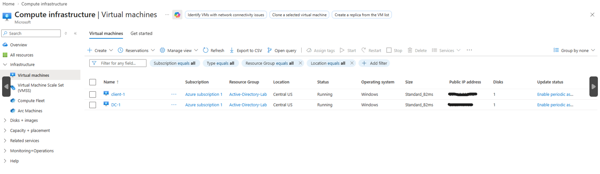
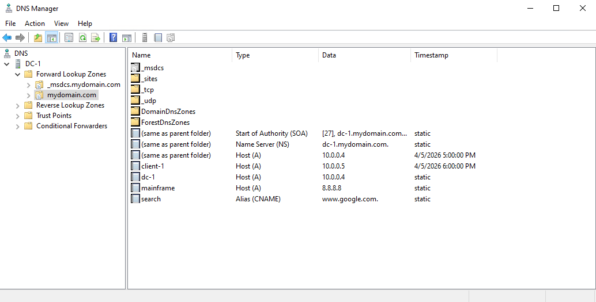
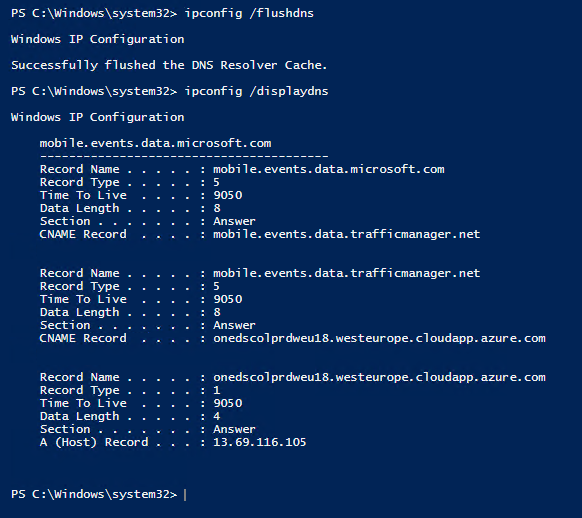

# DNS Lab – Active Directory

Hands-on DNS lab in an Active Directory environment demonstrating A record creation, CNAME configuration, and DNS cache troubleshooting.

---

## Overview
In this lab, I configured and tested DNS functionality within an Active Directory environment using a Windows Server Domain Controller and a Windows client machine.

---

## Lab Walkthrough

### A Record Creation & Testing
I started by attempting to ping a hostname ("mainframe") from the client machine before it existed in DNS. The request failed, confirming no DNS record was present.

I then created an A record on the Domain Controller mapping "mainframe" to the server’s private IP address.

After creating the record, I returned to the client machine and successfully pinged "mainframe", confirming proper DNS resolution.

---

### DNS Cache Behavior
Next, I modified the A record for "mainframe" to point to a different IP address (8.8.8.8).

When I tested from the client again, it still resolved to the old IP address due to DNS caching.

I used `ipconfig /flushdns` to clear the cache, then tested again and confirmed the updated IP was now being used.

---

### CNAME Record Testing
I created a CNAME record named "search" that pointed to an external domain (google.com).

From the client machine, I tested name resolution and confirmed that "search" correctly redirected to the target domain, demonstrating how CNAME records function as aliases.

---

## Screenshots & Walkthrough

### Azure Virtual Machines

Both the Domain Controller (DC-1) and Client machine (Client-1) are running in Azure, providing the environment for DNS testing.

---

### DNS Manager – Record Configuration

Created and modified DNS records including an A record for "mainframe" and a CNAME record pointing "search" to an external domain.

---

### DNS Cache (Before Flush)

The client machine still resolves the old IP address due to cached DNS records, demonstrating how DNS caching can cause outdated results.

---

### DNS Cache (After Flush)

After flushing the DNS cache, the client retrieves the updated DNS record, confirming successful propagation and resolution.

---

## What This Lab Demonstrates
- Creating and modifying DNS A records  
- Understanding DNS name resolution  
- Identifying DNS caching issues  
- Flushing DNS cache to resolve outdated records  
- Configuring and testing CNAME records  

---

## Key Skills Demonstrated
- DNS Troubleshooting  
- Active Directory DNS  
- Command Line Tools (ipconfig, nslookup)  

---

## Author

Matthew Hestand  
Aspiring IT Support Specialist  
CompTIA A+ (Core 1 Passed)
